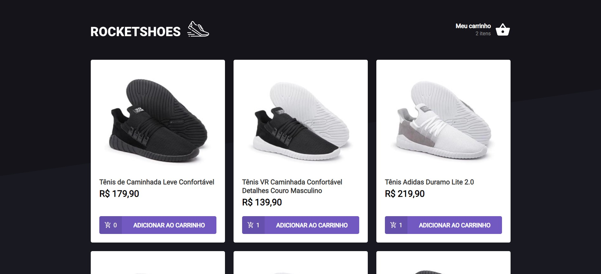

<!-- Logo -->

    

  
<!-- Atribuições-->
Projeto Ignite ReactJs, na <a href="https://rocketseat.com.br/"><em>Rocketseat</em></a>

## 🧪 Tecnologias

Esse projeto foi desenvolvido com as seguintes tecnologias:
- [React](https://reactjs.org)
- [TypeScript](https://www.typescriptlang.org/)
- [Json-Server](https://github.com/typicode/json-server)
- [Styled Components](https://styled-components.com/)
## 💻 Projeto

RocketShoes é um website feito para simular o funcionamento de um carrinho de compras, utilizando a temática na venda de sapatos. 

Este é um projeto desenvolvido no programa **[Ignite ReactJs](https://www.rocketseat.com.br/ignite)**, feito pela Rocketseat.
